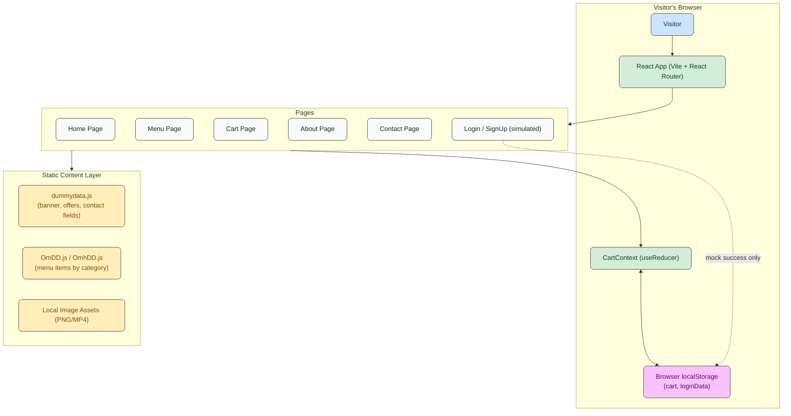
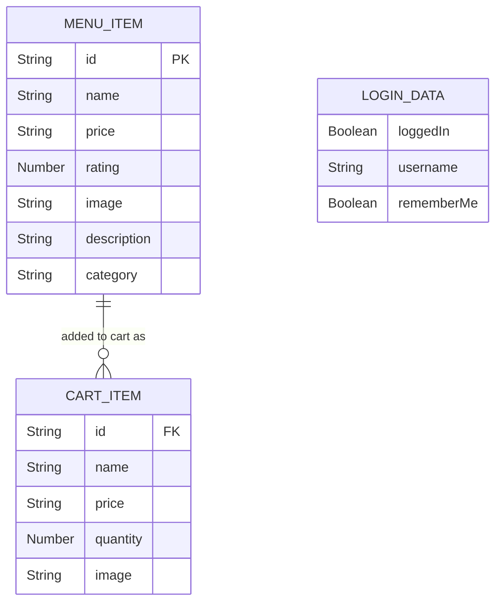
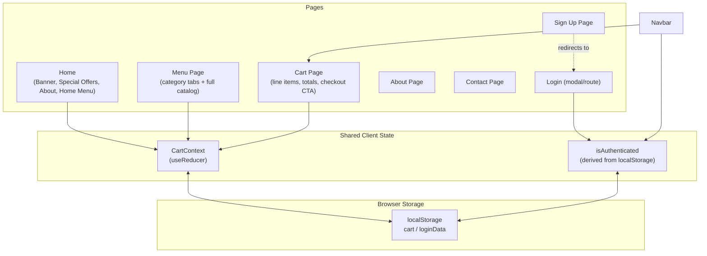
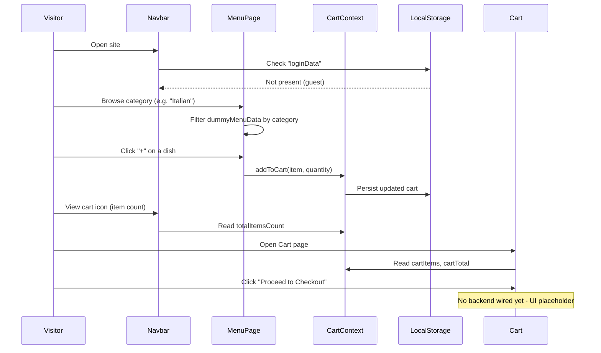
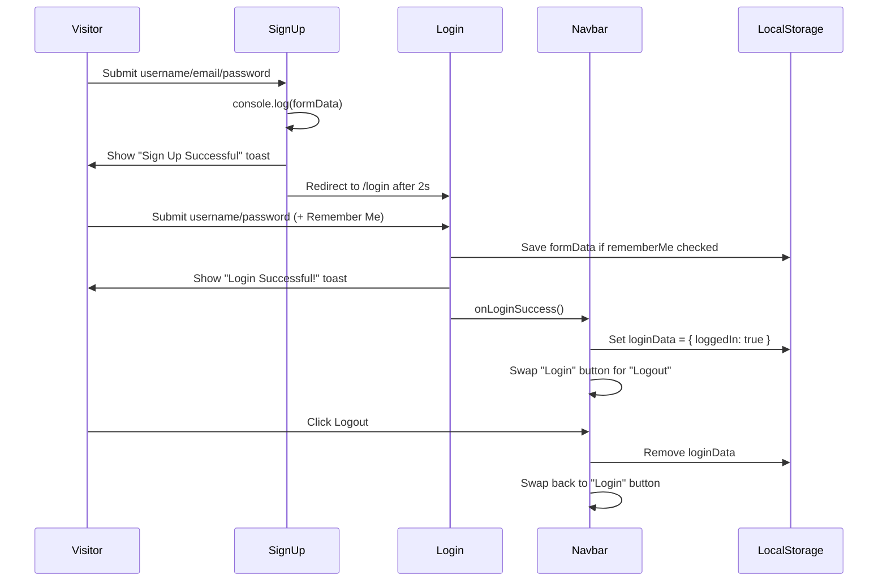

# Complete Case Study - Foodie Frenzy ([Repository](https://github.com/MemonaAmirAbdulHaq/Foodie-Frenzy))

## Overview

**Foodie Frenzy** is a richly animated, single-page **restaurant & food-delivery marketing site** built as a frontend-only React application. Unlike a transactional e-commerce platform, it focuses on **presentation, browsing, and a client-side cart experience** rather than a connected backend.

o- **Visitors** land on a cinematic hero banner, browse curated "Special Offers," explore a full categorized menu, and build up a shopping cart entirely in the browser.

o- **The cart** persists across page reloads using `localStorage`, so a visitor's selections survive a refresh even without an account.

o- **Sign-up, login, and contact forms** are present and fully interactive, but currently simulate success client-side (toast notifications, `localStorage` flags) rather than calling a real backend — this is a frontend-only repository with no API or database layer.

The project leans heavily on **Tailwind CSS 4** for an amber/gold "fine dining" visual identity, **Framer Motion** for animated transitions, and a custom **React Context + `useReducer`** cart engine.

---

## Goals of the Project

**Foodie Frenzy** is designed as a portfolio-grade, visually polished food ordering UI that demonstrates strong frontend craftsmanship without yet requiring backend infrastructure.

o- **Immersive brand experience** – A video-backed banner, floating particle effects, and a warm amber/charcoal palette create a premium restaurant feel rather than a generic storefront.

o- **Category-driven menu browsing** – Over a hundred dishes spanning Breakfast, Lunch, Dinner, Mexican, Italian, Desserts, and Drinks, browsable by category tabs.

o- **Persistent client-side cart** – Add, increment, decrement, and remove items, with totals and item counts (including a compact "1.2k"-style formatter) calculated entirely on the client.

o- **Foundation for a future backend** – The component boundaries (Cart, Login, SignUp, Contact) are already shaped like they're waiting for real API calls, making this a natural stepping stone to a full-stack build.

---

## System Architecture Overview

The platform is built as a **frontend-only single-page application** with the following core technologies:

| **Layer**          | **Technology**                 | **Purpose**                                        |
|---------------------|---------------------------------|-----------------------------------------------------|
| Frontend            | React 19 + Vite 7               | UI rendering and build tooling                      |
| Routing             | React Router DOM 7              | Client-side page navigation                         |
| State Management    | React Context + `useReducer`    | Cart state (add/remove/update quantity)             |
| Styling             | Tailwind CSS 4                  | Utility-first styling and theming                   |
| Animation           | Framer Motion                   | Page/element transitions and motion effects          |
| Icons               | react-icons                     | UI iconography (Fa, Fi, Gi icon sets)               |
| Persistence         | Browser `localStorage`          | Cart contents and a mock "remember me" login flag    |
| Data Source         | Local JS modules (`dummydata.js`, `OmDD.js`) | Static menu, banner, and content data |
| Deployment          | *Not configured in this repo* (no backend, no `vercel.json`, no `.env`) | — |

> **Note:** This repository contains **no backend** (no Express server, no database, no API routes). All "authentication," "checkout," and "search" interactions are simulated client-side. The earlier MultiVendor and ELearning case studies describe full-stack systems; Foodie Frenzy, by contrast, is a frontend showcase.

---

## System Architecture Diagram

---

## Key Features

### Home Experience

o- **Hero Banner**: Video-backed banner with a search bar (UI only — logs the query, not yet wired to filtering)
o- **Special Offers**: A curated grid of featured dishes with "Show More" expansion and inline add-to-cart controls
o- **About Section (Home)**: Brand storytelling block with stats (e.g., "10M+ Deliveries", "98% Satisfaction") and feature highlights
o- **Floating Particle Effects**: A reusable animated-particle background component used to add ambience to sections

### Menu Browsing

o- **Category Tabs**: Breakfast, Lunch, Dinner, Mexican, Italian, Drinks (and Desserts in the underlying dataset)
o- **100+ Menu Items**: Each item has a name, price, rating, description, and dedicated image asset
o- **Inline Quantity Stepper**: Add an item, then increment/decrement its quantity directly on the menu card without leaving the page

### Cart System

o- **Add / Remove / Update Quantity**: A `useReducer`-based cart engine (`ADD_ITEM`, `REMOVE_ITEM`, `UPDATE_QUANTITY` actions)
o- **Persistent Cart**: Cart contents are written to and rehydrated from `localStorage`, surviving page refreshes
o- **Live Totals**: Running grand total and total item count, with a compact "k"-style formatter for large counts
o- **Empty-State UI**: A dedicated "Your culinary canvas is completely empty" empty-cart view
o- **Checkout CTA**: A "Proceed to Checkout" button is present in the UI as a placeholder for a future payment flow

### Simulated Auth & Contact

o- **Sign Up**: Captures username/email/password, shows a success toast, then redirects to `/login` (no account is actually created)
o- **Login**: Captures credentials, supports a "Remember Me" checkbox that persists form data to `localStorage`, and flips a local `isAuthenticated` flag read by the Navbar
o- **Logout**: Clears the `localStorage` login flag
o- **Contact Form**: Captures name/email/message and logs the submission to the console on submit

### Brand Pages

o- **About Page**: Team members, mission/feature highlights, and brand statistics
o- **Contact Page**: Contact form alongside social and address information

---

## Tech Stack

**Frontend:**

**React 19** – Component-based UI library
**Vite 7** – Dev server and production build tooling
**React Router DOM 7** – Client-side routing (`/`, `/menu`, `/cart`, `/about`, `/contact`, `/login`, `/signup`)
**Tailwind CSS 4** – Utility-first styling with a custom amber/charcoal theme
**Framer Motion** – Animations and transitions
**react-icons** – Fa / Fi / Gi icon families used throughout the UI

**State & Persistence:**

**React Context API + `useReducer`** – Centralized cart state management
**Browser `localStorage`** – Cart persistence and a mock login/"remember me" flag

**Tooling:**

**ESLint** – Linting with React Hooks and React Refresh plugins
**@tailwindcss/vite** – Tailwind's Vite plugin integration

---

## Challenges & Solutions

| Challenge | Solution |
|-----------|---------|
| **Cart state needed to survive page refreshes without a backend** | Implemented a `useReducer`-based `CartContext` whose initializer reads from `localStorage` on mount, and an effect that writes the cart back to `localStorage` on every change. |
| **Large product catalog (100+ dishes across 7 categories) needed structured, image-rich data without a database** | Modeled the catalog as plain JS objects keyed by category (`dummyMenuData` in `OmDD.js`/`OmhDD.js`), each item carrying `id`, `name`, `price`, `rating`, `image`, and `description`. |
| **Displaying large quantities (e.g., "12,400 orders") compactly** | Added a `formatTotalItems` helper that converts counts ≥1000 into a "k"-suffixed string (e.g., `1.2k`). |
| **Decrementing quantity below 1 needed to remove the item instead of going negative** | Cart and Menu components both special-case "decrease from quantity 1" to call `removeFromCart` instead of `updateQuantity`. |
| **Simulating a login experience before a real auth backend exists** | Built a self-contained `Login` component that toasts success, optionally persists form data via a "Remember Me" checkbox, and toggles a `loginData` flag in `localStorage` that the `Navbar` reads to swap between Login/Logout UI. |
| **Keeping the Navbar's auth state in sync with route changes** | Used a `useEffect` keyed on `location.pathname` to re-check `localStorage` and toggle the login modal whenever the user navigates to `/login`. |
| **Leftover/experimental code (e.g., a checkout-page draft) cluttering the asset folder** | An incomplete `dummyAdmin.jsx` checkout scaffold exists in `src/assets` but is not imported anywhere in the app — a cleanup candidate before any production hardening. |

---

## Data Model (Client-Side)

Since there is no database, the "data model" lives in JS modules and `localStorage` rather than MongoDB collections:

`CART_ITEM` records live only in React state, mirrored into the `cart` key in `localStorage`. `LOGIN_DATA` is a flat object stored under the `loginData` key, used purely to toggle UI state — it is not a real session and grants no actual access control.

---

## Application Flow Diagram

---

## Visitor Flow

---

## Simulated Auth Flow

---

## Best Practices

### State Management
o- **Reducer-based cart logic** keeps add/remove/update transitions explicit and predictable (`ADD_ITEM`, `REMOVE_ITEM`, `UPDATE_QUANTITY`).
o- **Memoized dispatch callbacks** (`useCallback`) for `addToCart`, `removeFromCart`, and `updateQuantity` to avoid unnecessary re-renders in consuming components.
o- **Lazy state initialization** from `localStorage` via the reducer's initializer function, avoiding a flash of empty state before hydration.

### Component Architecture
o- **Page components compose smaller feature components** (e.g., `Home` = `Navbar` + `Banner` + `SpecialOffer` + `AboutHome` + `OurHomeMenu` + `Footer`), keeping route-level files thin.
o- **Shared visual primitives** (`FloatingParticle`, shared Tailwind class strings like `inputBase`/`iconClass` in `dummydata.js`) reduce duplication across forms and effects.

### Styling & UX
o- **Consistent theming** via a recurring amber/charcoal Tailwind palette and serif/script font pairings (`font-dancingscript`, `font-cinzel`) across every page.
o- **Responsive grid layouts** (`grid-cols-1` up to `xl:grid-cols-4`) for menu and offer cards across breakpoints.
o- **Toast feedback** for sign-up/login actions gives immediate, if simulated, confirmation of user actions.

---

## Conclusion

Foodie Frenzy is best understood as a **polished frontend prototype** rather than a complete e-commerce system: it nails the visual identity, animated interactions, and a genuinely persistent client-side cart, but its authentication, checkout, and search are intentionally (or currently) simulated rather than backend-driven. As a case study, it's a good illustration of how far thoughtful component design, Context-based state, and `localStorage` persistence can carry a food-ordering UI before a real API layer is introduced — and it sets up a clear next step: wiring the existing Cart, Login, SignUp, and Contact components to an actual backend (à la the ELearning LMS or MultiVendor case studies) would turn this from a showcase into a production-ready ordering platform.
